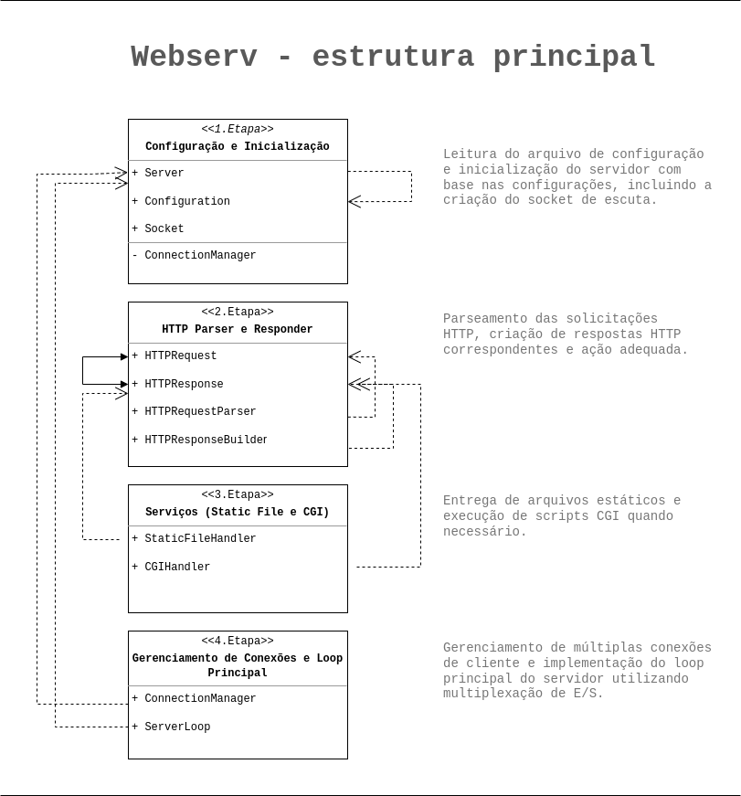

# **WebServ**

O objetivo deste projeto é criar um servidor HTTP usando multiplexação de E/S [entrada e saída] em um loop de eventos. <br>

## **Sobre o repositório**

[`WebServ`](./WEBSERV/): arquivo contendo o código-fonte da aplicação. <br>
[`Info`](./concepts.md): conceitos e aprendizados necessários.


## **Tecnologias utilizadas**

- [**Analysis tool**](https://valgrind.org/docs/manual/manual-core-adv.html) : software para depuração e localização de erros.
- [**C++**](https://cplusplus.com/) : linguagem que suporta o paradigma de orientação à objetos. 
- [**Curl**](https://curl.se/) : ferramenta de linha de comando para transmissão de dados. Protocolos usados : HTTP, DNS, ICMP (como utilitário PING).
- [**Git**](https://git-scm.com/) : para controle das versões dos arquivos.
- [**Github**](https://github.com/carlalrfranca/WebServ) : repositório para os arquivos.
- [**Makefile**](https://www.gnu.org/software/make/) : script aplicado para automatizar a compilação do projeto.
- [**Trello**](https://trello.com/c/IVK7hJ26/13-2007) : ferramenta visual para planejamento e organização.
- [**Stackedit**](https://stackedit.io/) : editor Markdown para escrever a documenntação do projeto.
- [**Vscode**](https://code.visualstudio.com/) : editor de código-fonte.
- [**Diagrams**](https://app.diagrams.net/) : ferramenta para criação de diagramas.
- [**Markdown**](https://www.markdownguide.org/) : linguagem de marcação padronizada para formatação de textos Web, usada para escrever a documentação.


## **Métodos e verbos usados**


## **Árvore do Diretório e a lógica de organização**


## **Divisão em Quatro etapas**




Essa reformulação inclui a divisão de configuração e leitura do arquivo de configuração como uma parte principal, o que é mais apropriado para lidar com essa tarefa específica.
Dessa forma, a estrutura fica mais organizada e modular, onde cada parte tem sua responsabilidade bem definida, tornando o código mais fácil de desenvolver, depurar e manter.<br> 

## **Configuração e Inicialização**

Aqui ficará concentrado as classes e componentes responsáveis por ler o arquivo de configuração, fazer o parse e armazenar as configurações do servidor.
Essa parte também lidará com a inicialização do servidor e a configuração do socket.

### Classes
ConfigurationParser: Responsável por fazer o parse do arquivo de configuração e extrair as configurações relevantes do servidor. <br>
Configuration: Responsável por armazenar as configurações extraídas do arquivo de configuração, como porta, diretório raiz, etc. <br>
Server: Representa o servidor web em si e gerencia a inicialização com base nas configurações fornecidas. <br>
Socket: Encapsula o socket de escuta e outras operações relacionadas à comunicação com os clientes.

## **HTTP Parser e Responder**

Nesta parte, estarão as classes responsáveis pelo parseamento das solicitações HTTP recebidas e pela construção das respostas HTTP.

### Classes
HTTPRequest: Representa uma solicitação HTTP recebida e contém informações como método, URL e cabeçalhos. <br>
HTTPResponse: Representa uma resposta HTTP e contém informações como código de status, cabeçalhos e corpo da resposta. <br>
HTTPRequestParser: Responsável por fazer o parse das solicitações HTTP recebidas e criar objetos HTTPRequest. <br>
HTTPResponseBuilder: Responsável por construir objetos HTTPResponse com base nas ações do servidor.

## **Serviços (Static File e CGI)**

Nesta parte, ficarão as classes responsáveis por servir arquivos estáticos e executar scripts CGI.

### CGI (Common Gateway Interface)  
O CGI é uma parte muito importante uma vez que é através dele que conseguimos executar programas ou scripts externos e retornar seus  
resultados ao server - o que, por conseguinte, é repassado ao client. Ou seja, com essa técnica, é possível criar paǵinas dinâmicas  
e personalizadas.  
Tome como exemplo uma página de formulário:  
  
```<!DOCTYPE html>
<html>
<head>
    <title>Exemplo de Formulário CGI</title>
</head>
<body>
    <h2>Preencha o Formulário</h2>
    <form action="process_form.cgi" method="post">
        Nome: <input type="text" name="nome"><br>
        E-mail: <input type="text" name="email"><br>
        <input type="submit" value="Enviar">
    </form>
</body>
</html>
```  
  
Através do atributo `action`, referenciamos o script CGI que irá receber e tratar as informações submetidas no formulário.  
Entre essas duas pontas está o servidor, que fica responsável de identificar que a solicitação pede pelo recurso do script CGI,  
abre um ambiente para essa execução (possivelmente com o uso de fork() e dup()), e trata de passar os valores inseridos pelo  
usuário no formulário para o script - por meio de variáveis de ambiente, por exemplo (QUERY_STRING).  
Uma vez que o script CGI receba esses valores e produza uma saída, a ideia é que isso seja redirecionado para o server, que  
repassa esse conteúdo (geralmente, em formato de página de html) para o client.  
Resumindo:  
- Servidor recebe a solicitação que pede pelo recurso do CGI  
- Configura as variáveis de ambiente necessárias antes de executar o script CGI  
- O servidor executa o script CGI em um outro processo (fork) passando os parâmetros da solicitação (e env QUERY_STRING?)  
- Resposta do script CGI que é capturada pelo servidor e este, por sua vez, a repassa ao client  
  
Para fazer a chamada ao script CGI, seguimos os seguintes passos:  
1. Criação de um processo filho por meio do fork()  
2. Redirecionamento de file descriptors (saída e entrada padrão) usando a função dup2()  
Isso pode incluir a redireção da entrada padrão (stdin) para um socket ou pipe de onde você lê os dados do corpo da solicitação (então o script usaria funções que leem por padrão do STDIN, mas como teremos "redirecionado" o STDIN para um pipe - ou socket? -, ele lerá o corpo da solicitação), e também a redireção da saída padrão (STDOUT) para um novo file descriptor em que capturamos a saída gerada pelo script CGI.  
3. Execução do script CGI usando exec()  
4. Leitura da saída do script CGI  
Após o retorno ao processo pai, lemos a saída do script a partir do file descriptor para o qual redirecionamos a saída padrão (STDOUT)  
5. Envio da resposta do script ao client  
Envie a saída lida do script CGI de volta ao client como parte da resposta HTTP.  
  
### Classes
StaticFileHandler: Responsável por lidar com a entrega de arquivos estáticos para os clientes. <br>
CGIHandler: Responsável por executar scripts CGI e incluir a saída na resposta HTTP.

## **Gerenciamento de Conexões e Loop Principal**

Essa parte ficarão concentrados as classes relacionadas ao gerenciamento de conexões com os clientes e ao loop principal do servidor.<br>

### Classes
ConnectionManager: Responsável por gerenciar as conexões de cliente, incluindo a adição e remoção de sockets da lista de sockets a serem monitorados. <br>
ServerLoop: Implementa o loop principal do servidor, aguardando e processando as solicitações dos clientes.


## **Erros encontrados e Soluções**


## Acesso

#### 1. Repo

`git clone https://github.com/carlalrfranca/WebServ.git`


#### 2. Curl

`sudo apt-get install -y libcurl4-gnutls-dev`


#### 3. Compilação

`cd webserv` : acessa o diretório <br>
`make` : compila o projeto <br>
`make clean` : remove objetos <br>
`make fclean` : remove objetos e arquivos binários <br>
`make re` : recompila <br>


#### 4. Códigos usados e depuração


- Sintaxe do comandos usados : ```$ curl [OPÇÕES] [URL]```

| Comando       | Descrição                                                           |
|:--------------|:--------------------------------------------------------------------|
| -i            | <sub> retorna o corpo e a header </sub>                             |
| -i  --include | <sub> retorna a header no output </sub>                             |
| -I            | <sub> retorna a header  </sub>                                      |
| -d  --data	| <sub> dados a serem enviados no POST   </sub>                       |
| -H  --header  | <sub> envia header da requisição   </sub>                           |
| -X  --request |	<sub> especifica o método HTTP a ser usado na requisição </sub>   |


- Depuração Valgrind : `valgrind --track-origins=yes --leak-check=full --show-leak-kinds=all`

| Comando               | Descrição                                                  |
|:----------------------|:-----------------------------------------------------------|
| --track-origins=yes   | <sub> rastreia as origens de valores não iniciados </sub>  |
| --leak-check=full     | <sub> retorna o detalhamento dos vazamentos </sub>         |
| --show-leak-kinds=all | <sub> relatório completo dos vazamentos </sub>             |


#### 5. Comandos usados